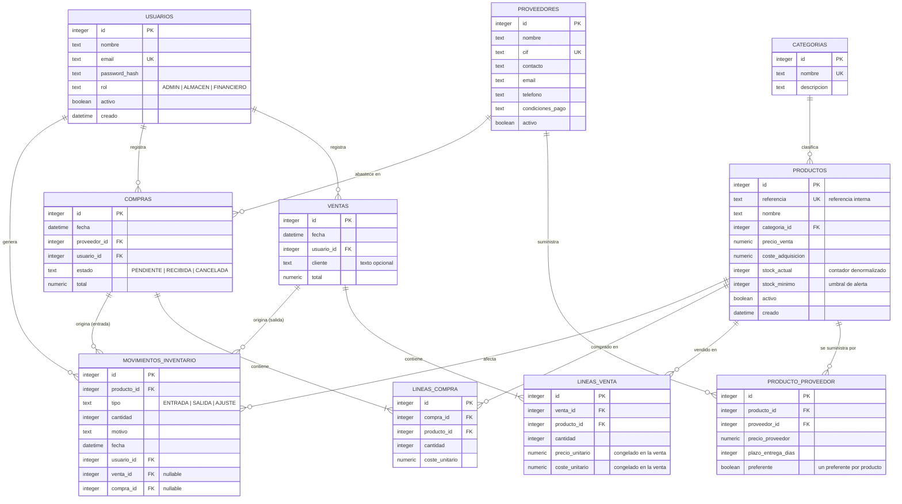

# Modelo de datos — Gestor de Inventario (Propuesta A)

Base de datos **relacional en SQLite 3**, gestionada mediante el ORM **SQLAlchemy**.
El esquema consta de **10 tablas** que cubren usuarios/roles, catálogo de productos,
proveedores, ventas, compras y el historial de movimientos de inventario.

## Diagrama entidad-relación

## Relaciones principales

| Relación | Cardinalidad | Descripción |
|---|---|---|
| `categorias` → `productos` | 1:N | Una categoría agrupa varios productos. |
| `productos` ↔ `proveedores` | N:M (vía `producto_proveedor`) | Un producto puede tener varios proveedores y viceversa; cada relación guarda su precio. |
| `ventas` → `lineas_venta` | 1:N | Una venta incluye varias líneas (varios productos). |
| `compras` → `lineas_compra` | 1:N | Una compra incluye varias líneas. |
| `proveedores` → `compras` | 1:N | Cada compra se hace a un proveedor. |
| `productos` → `movimientos_inventario` | 1:N | Todo movimiento (entrada/salida/ajuste) afecta a un producto. |
| `usuarios` → `ventas`/`compras`/`movimientos` | 1:N | Trazabilidad: quién realizó cada operación. |

## Decisiones de diseño

- **`stock_actual` es un contador denormalizado.** La fuente de verdad del stock es
  `movimientos_inventario`. Una venta genera un movimiento **SALIDA** y una compra recibida
  un movimiento **ENTRADA**; ambos actualizan `stock_actual` **en la misma transacción**.
- **El margen de beneficio no se almacena como valor editable**, se calcula como
  `precio_venta - coste_adquisicion` (propiedad del modelo / columna calculada).
- **`lineas_venta` congela `precio_unitario` y `coste_unitario`** en el momento de la venta,
  para que las métricas históricas de beneficio y rentabilidad sean correctas aunque los
  precios del producto cambien después.
- **`cliente`** es un campo de texto opcional en `ventas` (no una entidad CRM, no lo exige el enunciado).
- **Roles como valor enumerado** (`ADMIN`, `ALMACEN`, `FINANCIERO`) en `usuarios`, no una tabla de roles.

## Notas específicas de SQLite

- **Claves foráneas:** SQLite las desactiva por defecto. Se activa `PRAGMA foreign_keys = ON`
  en cada conexión mediante un *listener* de SQLAlchemy.
- **Importes monetarios:** SQLite no tiene un tipo `DECIMAL` real. Los campos `numeric` se
  definen con `Numeric(10, 2)`; como alternativa más robusta frente a redondeo pueden
  almacenarse como enteros de céntimos.
- **Fechas:** se guardan en formato ISO-8601 (tipo `DateTime` de SQLAlchemy).
